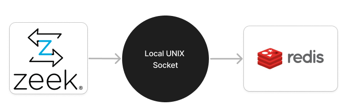

ZeekJS-Redis
=================================

This [zkg](https://docs.zeek.org/projects/package-manager/en/stable/zkg.html) package implements a method of parsing [Zeek](https://zeek.org/) logs to [Redis](https://redis.io/). [ZeekJS](https://zeekjs.readthedocs.io) is utilised to achieve this. Using a [Unix socket](https://en.wikipedia.org/wiki/Unix_domain_socket) for data transmission, this package builds upon the (log-bypass)[https://github.com/corelight/zeekjs/blob/main/doc/examples/log-bypass.js] example from the ZeekJS repository, to enhance storage options and faster data analysis.

<p align="center">
  
</p>

The intent with the development of this package was to "[kick the tyres](https://dictionary.cambridge.org/dictionary/english/kick-the-tires)" and gain familiarity with [ZeekJS](https://zeekjs.readthedocs.io). The overall experience was positive; it was possible to create a working version of features that would have taken me much longer to develop in Zeek's standard C++ plugin architecture. Time saved enabled implemention of more involved [config options](https://github.com/mbispham/zeekjs-redis/blob/main/configure.plugin).  

### Example

**1. Run the test PCAP through Zeek:**  
After installing the package run the test pcap with zeek.
```shell
/opt/zeek/var/lib/zkg/clones/package/zeekjs-redis.git# zeek -C LogAscii::use_json=T -r testing/Traces/zeekjs-redis-test.pcap ./scripts/index.js
```
`-C` avoids checksum errors, `LogAscii::use_json=T` enables JSON formatted logs. Note, if installing from a local git pull, the pathway is likely:

```
PREFIX_PATH=$(zeek-config --prefix)
FULL_PATH="${PREFIX_PATH}/var/lib/zkg/clones/package/zeekjs-redis"
```

**2. Access Redis using the CLI:**  
Connect to Redis through the Unix socket to query the results.
```shell
/opt/zeek/var/lib/zkg/clones/package/zeekjs-redis.git# redis-cli -s /var/run/redis/redis.sock
```

**3. View the keys stored in Redis:**  
Check what keys are in Redis after running Zeek.
```
redis /var/run/redis/redis.sock> KEYS *
1) "zeek_packet_filter_logs"
2) "zeek_conn_logs"
```

**4. Retrieve log data from Redis:**  
Fetch the stored conn logs.
```
redis /var/run/redis/redis.sock> LRANGE zeek_conn_logs 0 -1
```

Example Output:
``` 
1) "{\"ts\":1616775350.763199,\"uid\":\"XXX\",\"id\":{\"orig_h\":\"192.168.220.35\",\"orig_p\":53537,\"resp_h\":\"192.168.220.1\",\"resp_p\":31981},\"proto\":\"tcp\",\"conn_state\":\"S0\",\"local_orig\":true,\"local_resp\":true,\"missed_bytes\":0,\"history\":\"S\",\"orig_pkts\":1,\"orig_ip_bytes\":44,\"resp_pkts\":0,\"resp_ip_bytes\":0}"
...
24) "{\"ts\":...
```

### Build

Install with [zkg](https://docs.zeek.org/projects/package-manager/en/stable/index.html):
```
zkg install https://github.com/mbispham/zeekjs-redis.git
```

The following options can be used to create a suitable environmental for the package

    --install-npm-dependencies Install npm dependencies from package.json (N/y)
    --install-redis-cli        Install redis-cli if not present (N/y)
    --redis-conf-path=PATH     The path to Redis config (Default = /etc/redis/redis.conf)
    --redis-socket-path=PATH   The path to Redis socket (Default = /var/run/redis/redis.sock)
    --start-redis-server       Start redis server (N/y)

Install with `--force` if you want to install npm dependencies separately, use default settings, or modify `scipts/.env` directly:
```
zkg install https://github.com/mbispham/zeekjs-redis.git --force
```

### Filtered Log Usage

If the intention is to export specific fields from Zeek logs to Redis, an example modification to `index.js` is outlined below:

```
  ...
  logID = logID.replace(/([a-z0-9])([A-Z])/g, '$1_$2').toLowerCase();

  const logFile = `${logID}.log`;
  const redisKey = `zeek_${logID}_logs_orig_ip_bytes`;
  const logRec = zeek.select_fields(logData, zeek.ATTR_LOG);
  if (!('orig_ip_bytes' in logRec)) {
    return;
  }

  const origBytes = logRec.orig_ip_bytes;
  const serializedData = stringify(origBytes);
  ...
```

### Dependencies

- [Zeek > 6.0.2](https://github.com/zeek/zeek/blob/master/NEWS#L647) - Experimental ZeekJS supported as a builtin package
- [Redis-cli](https://redis.io/docs/latest/develop/connect/cli/)
- [NPM](https://docs.npmjs.com/downloading-and-installing-node-js-and-npm) - Ensure Node.js is [configured](https://zeekjs.readthedocs.io/en/latest/#compiling-node-js-from-source) with shared OpenSSL 
  - [dotenv](https://www.npmjs.com/package/dotenv)
  - [redis](https://www.npmjs.com/package/redis)
  - [safe-stable-stringify](https://www.npmjs.com/package/safe-stable-stringify)
  - [validator](https://www.npmjs.com/package/validator)
  - [winston](https://www.npmjs.com/package/winston)

### Acknowledgements

- [**Christian Kreibich**](https://github.com/ckreibich): [Zeek](https://zeek.org/) project technical lead
- [**Arne Welzel**](https://github.com/awelzel): Main author of [ZeekJS](https://zeekjs.readthedocs.io)
- [**Simeon Miteff**](https://github.com/simeonmiteff): The structure of this project was inspired by Simeon's work on integrating telegram with Zeek [zeekjs-notice-telegram](https://github.com/corelight/zeekjs-notice-telegram)
- [**WRCCDC**](https://wrccdc.org): [zeekjs-redis-test.pcap](https://github.com/mbispham/zeekjs-redis/blob/main/testing/Traces/zeekjs-redis-test.pcap) is carved from a publicly available trace released under a [creative commons license](https://creativecommons.org/licenses/by-sa/4.0/)

### License 
[zeekjs-redis](https://github.com/mbispham/zeekjs-redis) is free and open-source software licensed under the [3-clause BSD license](LICENSE).

### Feedback and Contributions
Feedback and/or contributions are welcome.
